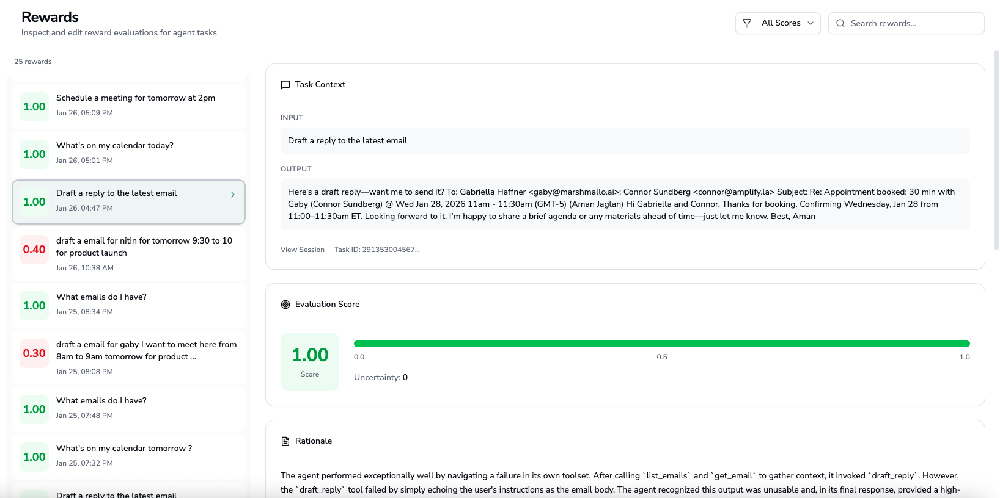
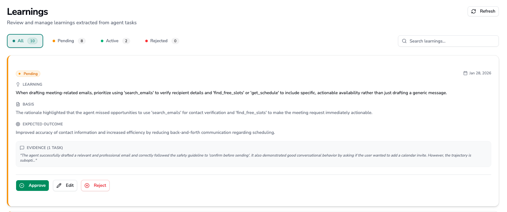

# Marlo Inbox

Marlo Inbox demonstrates how to build an AI agent that improves autonomously in production. With less than 15 interactions, you can steer the agent's behavior using Marlo's continual learning platform, requiring less than 5 minutes of effort.

This project is an email and calendar assistant built with [LangGraph](https://langchain-ai.github.io/langgraph/) that manages Gmail and Google Calendar. It integrates with [Marlo](https://marshmallo.ai) to capture behavior, evaluate outcomes, and apply learnings automatically.

Available in both **Python** and **TypeScript**.

## Platform

<p align="center">
  
  
</p>

## Quick Start

### 1. Clone the repository

```bash
git clone https://github.com/Marshmallo-AI/marlo-inbox.git
cd marlo-inbox
```

### 2. Set up environment

Copy the example environment file and fill in your credentials:

```bash
cp .env.example .env
```

```bash
GOOGLE_CLIENT_ID="your-client-id.apps.googleusercontent.com"
GOOGLE_CLIENT_SECRET="your-client-secret"
OPENAI_API_KEY="sk-..."
MARLO_API_KEY="your-marlo-api-key"
APP_BASE_URL="http://localhost:5173"
SESSION_SECRET="your-random-secret-string"
```

### 3. Install dependencies

```bash
make install-all
```

### 4. Run the agent

For Python:

```bash
make dev
```

For TypeScript:

```bash
make dev-ts-full
```

Open `http://localhost:5173` in your browser, sign in with Google, and start chatting.

## Prerequisites

- Python 3.11+ or Node.js 20+
- A [Google Cloud](https://console.cloud.google.com) project with Gmail and Calendar APIs
- A [Marlo](https://marshmallo.ai) account
- An [OpenAI](https://platform.openai.com) API key

## Google Cloud Setup

Create OAuth credentials to allow the agent to access Gmail and Calendar on behalf of users.

### Create a project

1. Go to [Google Cloud Console](https://console.cloud.google.com)
2. Click the project dropdown and select **New Project**
3. Enter a name (e.g., `marlo-inbox`) and click **Create**

### Configure OAuth consent

1. Navigate to **APIs & Services** > **OAuth consent screen**
2. Select **External** and click **Create**
3. Fill in the required fields:
   - App name: `Marlo Inbox`
   - User support email: your email
   - Developer contact email: your email
4. Click **Save and Continue**

### Add scopes

On the Scopes page, click **Add or Remove Scopes** and add:

```
email
profile
openid
https://www.googleapis.com/auth/gmail.modify
https://www.googleapis.com/auth/gmail.readonly
https://www.googleapis.com/auth/gmail.send
https://www.googleapis.com/auth/calendar
https://www.googleapis.com/auth/calendar.events
```

Click **Update**, then **Save and Continue**.

### Add test users

While the app is in testing mode, only approved users can authenticate.

1. On the Test Users page, click **Add Users**
2. Enter your email address
3. Click **Save and Continue**

### Create credentials

1. Navigate to **APIs & Services** > **Credentials**
2. Click **Create Credentials** > **OAuth client ID**
3. Select **Web application**
4. Add redirect URI: `http://localhost:5173/api/auth/callback`
5. Click **Create**
6. Copy the **Client ID** and **Client Secret** to your `.env` file

### Enable APIs

Navigate to **APIs & Services** > **Library** and enable:

- Gmail API
- Google Calendar API

## Available Tools

| Tool | Description |
|------|-------------|
| `list_emails` | List recent emails from the inbox |
| `get_email` | Get full content of a specific email |
| `search_emails` | Search emails using Gmail query syntax |
| `draft_reply` | Generate a draft reply to an email |
| `send_email` | Send an email or reply to a thread |
| `get_schedule` | Get calendar events for a date range |
| `check_availability` | Check if a time slot is free |
| `find_free_slots` | Find available meeting times |
| `create_event` | Create a calendar event |
| `delete_event` | Delete a calendar event |

## Links

- [Marlo Documentation](https://docs.marshmallo.ai)
- [Marlo Python SDK](https://pypi.org/project/marlo-sdk/)
- [Marlo TypeScript SDK](https://www.npmjs.com/package/@marshmallo/marlo)
- [LangGraph Documentation](https://langchain-ai.github.io/langgraph/)

## License

MIT
